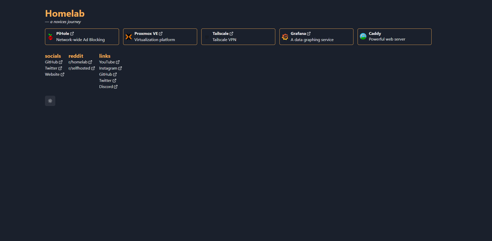

# Dashbird (WIP)

🐦 A simple and minimal dashboard for your homelab made with Chakra UI and NextJS!



## Features

-   💻 Simple configuration
-   🚀 Easily selfhostable
-   😍 Beautifully simplistic
-   ☀️ Light and Dark theme

## Why

I wanted to practice my frontend skills and this seemed like the perfect project as I wanted a dashboard for my homelab. I know there's plenty of dashboards but there's only one
_dashbird_.

## How

🐋 Docker:

Be sure you filled the config in `config.example.yml` and renamed it to `config.yml` run the following:

```shell
$ docker build -t dashbird .
$ docker run -p 3000:3000 dashbird
```

You can now visit http://localhost:3000!

...or do it manually.

## License

MIT
